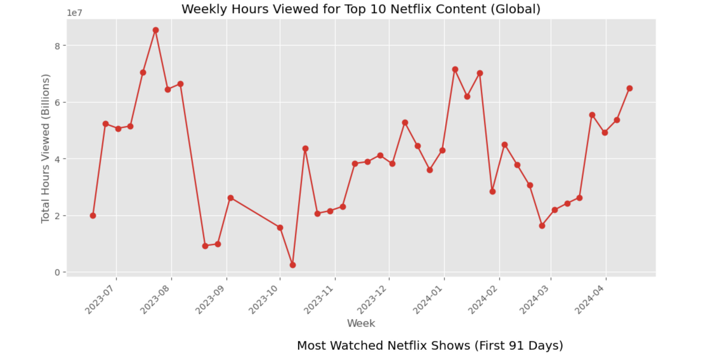
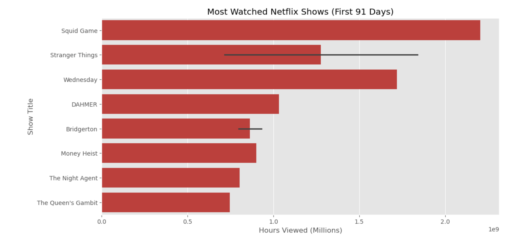
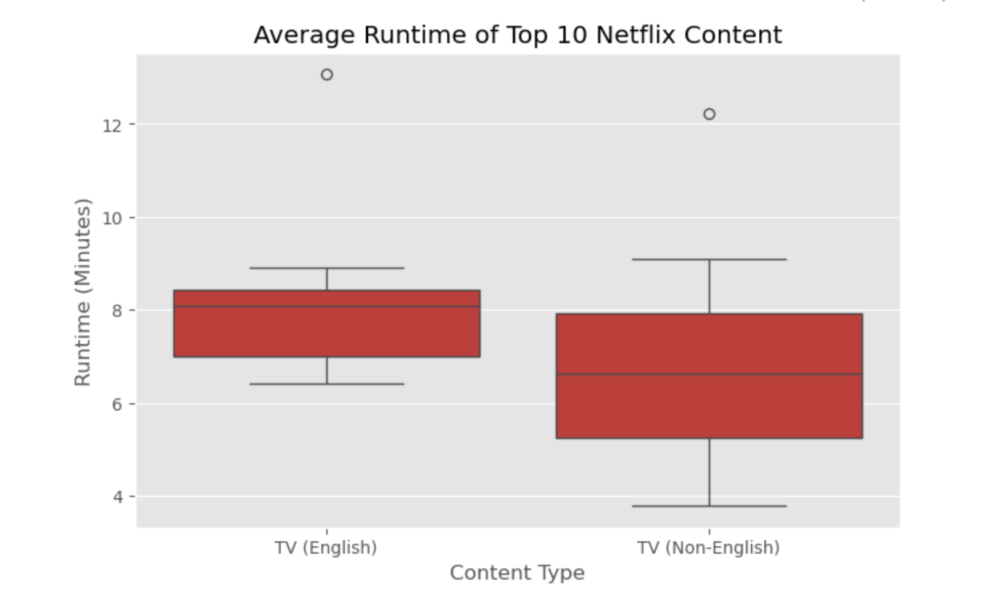
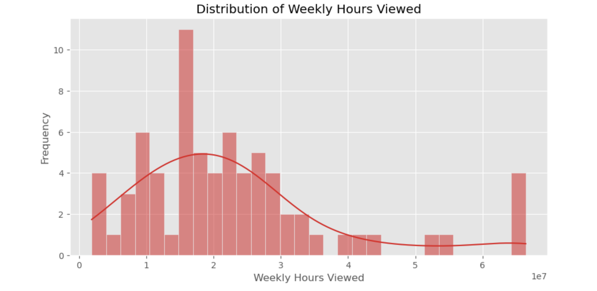
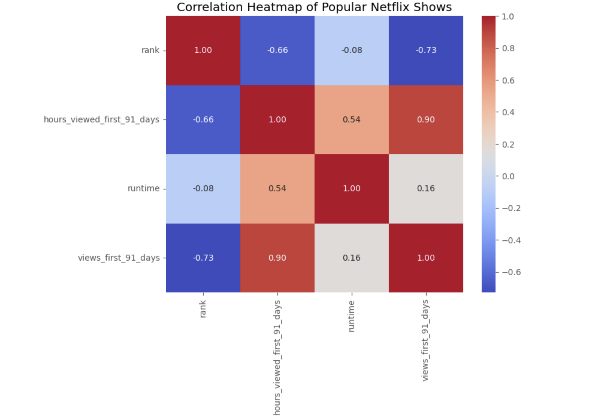

# NetflixTrendsAnalysis – Global Netflix Top 10 Content Analytics

## Author

**Darious Brown**

**GitHub:** https://github.com/Dare215

**LinkedIn:** https://www.linkedin.com/in/dariousbrown

**Portfolio:** https://dare215.github.io/DariousBrown-Portfolio/

**Email:** dariousbrown3@icloud.com

---

# Project Overview

NetflixTrendsAnalysis explores global Netflix Top 10 content performance using data analytics, statistical visualization, and exploratory data analysis (EDA).

The project examines audience engagement, content popularity, viewing behavior, runtime characteristics, and performance trends across Netflix's most watched television programs.

By transforming raw streaming metrics into actionable insights, this analysis demonstrates how data science can be applied within the entertainment and media industry.

The objective was to identify relationships between content rankings, runtime, audience engagement, and viewing hours while uncovering patterns that drive global streaming success.

---

# Visual Analysis

## Project Overview Visualization

### Netflix Trends Analysis

---

## Most Watched Netflix Shows (First 91 Days)

Squid Game remains the dominant global performer while Wednesday and Stranger Things continue to demonstrate exceptional audience engagement.

---

## Runtime Distribution by Content Type

English-language content generally demonstrates longer average runtimes than non-English content.

---

## Weekly Viewing Hours Distribution

Most content clusters around moderate viewing levels while a small number of blockbuster titles generate exceptionally high audience engagement.

---

## Correlation Analysis

The strongest relationship exists between total views and viewing hours, indicating that audience engagement metrics are highly correlated.

---
